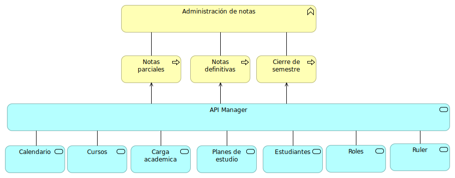
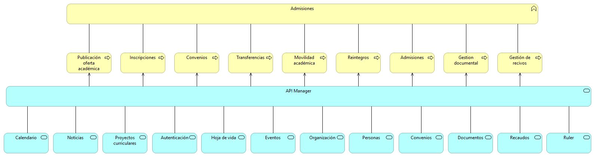
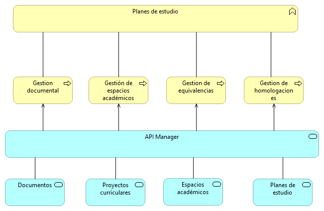
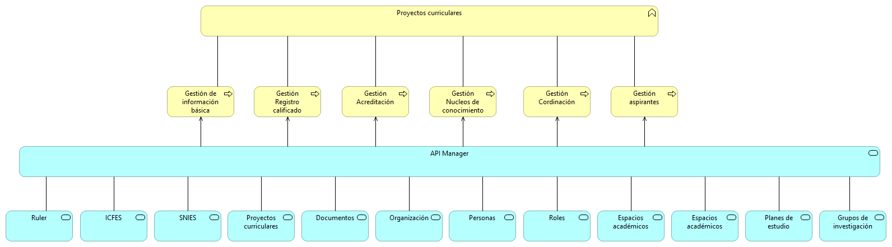

# Académica
Documento de arquitectura para la oficina asesora de sistemas del nuevo sistema de información académica
## Incumbencias

### administración de notas

### Admisiones

### Docentes

### Plan de estudios

### Programación académica

### Proyectos curriculares

### Recaudos

### Registros espacios académicos

