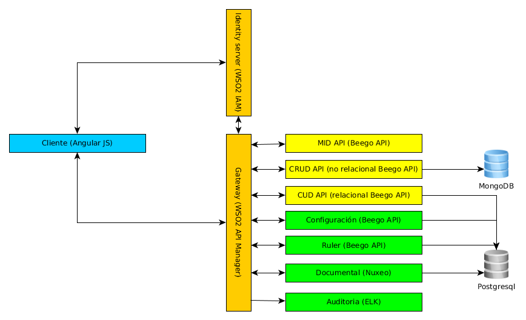

# Arquitectura de aplicaciones

## Alcance

La arquitectura de aplicaciones define el contexto de la estructura y características de las aplicaciones de los proyectos de desarrollo, la arquitectura aquí presentada pretende definir un entorno que permita aplicar metodologías ágiles al proceso de desarrollo con un alto grado de automatización de las diferentes etapas del ciclo de vida de desarrollo.

La presente propuesta arquitectural surge de la difcultad actual en el desarrollo del ciclo de vida de los proyectos de software por la característica monolítica de las aplicaciones y su puesta en producción. La estructura actual definida para las aplicaciones en los proyectos de desarrollo es inapropiada para promover la implantación total de agilismo en los procesos de desarrollo y en las diferentes fases o etapas que estos conllevan.

## Contexto

En cualquier sistema de mediano o gran alcance en la actualidad se deben soportar diferentes tipos de puntos o medios de acceso, también es común que se requiera acceso desde terceros a ciertos componentes del sistema e integraciones con otros tipos de sistemas mediante el consumo de servicios o el manejo de mensajes los cuales consumen lógica del negocio que corresponde a diferentes áreas funcionales del sistema.

## Características del entorno del sistema

* Hay equipos variables de desarrolladores trabajando en el sistema.
* Los nuevos miembros que llegan al equipo deben ser productivos lo más pronto posible.
* El sistema debe tener alta adaptabilidad y flexibilidad.
* Debe tener un alto grado de comprensibilidad dados los requerimientos de adaptabilidad.
* Se establece el sistema dentro de un entorno de integración y despliegue continuo.
* Existen requerimientos fuertes de escalabilidad y disponibilidad.
* Se desea aprovechar las ventajas de las tecnologías emergentes.

## Entorno general de aplicaciones

El entorno de las aplicaciones actualmente es una mixtura de arquitecturas, entre las cuales se mantienen aplicaciones con arquitecturas monolíticas, cliente servidor y orientadas a servicios; el mantenimiento y gestión de dicho entorno se convierte en fuente frecuente de problemas en los que por desconocimiento, por falta de documentación o por falta de planeación se realizan retrabajos, desarrollos duplicados, incongruencia en la información y otros problemas que se presentan frecuentemente.

Aunque ya existe una definición de elementos comunes que compartirán las aplicaciones o componentes del entorno de trabajo, como un servicio de identidades o un api manager que se comporta como gateway de peticiones a las apis, se debe hacer una transición hacia una separación de incumbencias con la finalidad de lograr una mejor gestión de los componentes de aplicación desarrollados.

## Orientación a servicios

La presente propuesta arquitectural esta enmarcada por las arquitecturas orientadas a servicios por lo tanto se defeine respetando los principios y priorizaciones que esta define, la orientación a servicios permite la entrega continua de valor al negocio de la organización, con mayor agilidad y alineada con necesidades cambiantes.

La arquitectura orientada a servicios , según el manifiesto SOA, establece las siguientes prioridades:

* **El valor del negocio** por encima de la estratégia técnica.
* **Las metas estrategicas** por encima de los beneficios de los proyectos.
* **La interoperatibidad intrínseca** por encima de la integración personalizada.
* **Los servicios compartidos** por encima de las implementaciones de propósito específico.
* **La flexibilidad** por encima de la optimización.
* **El refinamiento evolutivo** por encima de la búsqueda de la perfección inicial.

Así mismo establece unos principios rectores en los que:
* Reconoce la implicación de cambios en muchos niveles de la arquitectura.
* No está atada a una tecnología o estándar particular.
* Persigue la uniformidad hacia el exterior y a la vez que permitir la diversidad interna.
* Se identifican los servicios directamente con la colaboración de los interezados en el negocio y en la tecnología.
* Maximiza el uso de los servicios.
* Verifica la satisfacción de los requerimientos y las metas del negocio a través de los servicios.
* Evoluciona los servicios y su organización en respuesta al uso real.
* Separa los aspectos de un sistema en relación a sus tasas de cambio.
* Reduce las dependencia implicitas y publica las dependencias externas para incrementar la robustez.
* Organiza servicios alredeor de unidades funcionales facilitando su cohesión y administración.

## Microservicios

### Micro-servicios, que son?
Las arquitecturas orientadas a micro-servicios buscan descomponer aplicaciones monolíticas para mejorar las capacidades de despliegue y escalabilidad  en ambientes de frecuentes cambios y evolución de los sistemas. Esta descomposición propone retos no presentes en aplicaciones monolíticas.

Microservicios es el nombre de un estilo arquitectural de software, influenciado por el software distribuido. Un aspecto distintivo es la aplicación a nivel de componentes del principio de resposabilidad única, lo que se refleja en el hecho de que cada uno de los microservicios es responsable de un único problema en concreto.

Según Martín Fowler la arquitectura de microservicios es una particular manera de diseñar aplicaciones de software como un conjunto de servicios independientemente desplegables.

En la arquitectura de microservicios, los servicios deben ser pequeños, granulares, aislados, independientes y distribuibles. Estas características permiten:

* Priorizar recursos escasos.
* Desarrollo en paralelo, por diferentes grupos de desarrollo.
* Independencia tecnológica de cada servicio.
* Escalamiento individualizado.

### Compartiendo código entre microservicios
Una de las inquietudes en el proceso de adopción de microservicios es ¿Cómo compartir código entre microservicios? una respuesta a este punto puede ser la generación de librerías de utilitarias técnicas y funcionalidades comunes, se debe tener cuidado en evitar el acoplamiento entre servicios. También se puede pensar en configurar estas funcionalidades como servicios independientes que puedan se usados por los otros servicios. Con estas dos opciones se debe buscar y definir un punto de equilibrio para este tema.

### Comunicación entre microservicios
La comunicación entre microservicios también genera dudas, esta debe definirse desde la contextualización del negocio, ya que tenemos dos opciones para manejar este punto, la primera es comunicación con respuesta directa mediante el protocolo HTTP. La segunda opción será un mecanismo de suscripción y publicación a una cola de mensajes, lo que nos brinda un mecanismo asíncrono de comunicación evitando el acoplamiento.

### Gestión de las dependencias de los clientes
Una tercera preocupación es que dada la alta granularidad de los servicios como manejo el alto grado de dependencia que genera la comunicación e las peticiones de los clientes hacia los microservicios y que un cambio en los microservicios no afecte a los clientes de estos.

Para gestionar estas dependencias se sugiere el uso de un API Gateway, esta es una capa abstracta que oculta los microservicios a los clientes y ofrece un end-point único para la comunicación. Esto nos permite adicionalmente la monitorización de los microservicios.

## Arquitectura general de microservicios
La generación de microservicios permite desacoplar los módulos de las aplicaciones para facilitar su despliegue, pero esto supone el reto de establecer el mecanismo para que estos servicios trabajen en conjunto, la siguiente gráfica presenta la estructura propuesta para organizar dicho mecanismo, permitiendo a característica de servicios agnósticos.

### Cliente:
El cliente en la estructura de aplicaciones consisten en un componente estático que obedece al paradigma de "serverless" que únicamente maneja la capa de presentación hacia el usuario final, este componente de la estructura de aplicaciones genera peticiones al api-manager las cuales están orientadas a servicios de tipo MID.

Al estar definidos dentro de una arquitectura serverless permite que los clientes generados sean no-inteligentes, es decir que no embeban inteligencia de negocio en sus componentes, facilitando de esta manera el remplazo del cliente en cualquier momento o la generación de múltiples clientes desde distintas plataformas.

### Identity Server:
El Indentity server es el componente de autenticación, este componente es único para todos los servicios, su responsabilidad es autenticar a los usuarios, generar el token de autenticación y validar este cunado las APIs lo solicitan.

### API Gateway:
El API Gateway se comporta como un Gateway de solicitudes entre aplicaciones, toda la comunicación de solicitudes entre servicios debe ser atentida por el API Gateway y este direccionará la petición deacuerdo al catalogo de servicios configurados.

### Auditoría:
El servicio de auditoría es el responsable de registrar todos los eventos que ocurren entre los diferentes servicios, ya que el responsable de gestionar estos eventos es el API Manager, sera este quien se conecte con el servicio de auditoría para el registro del evento.

### RULER:
El ruler es el gestor de reglas de negocio para los servicios de tipo MID, a este le consultan la declaración de todos los predicaos que forman la base de conocimiento para cada contexto.

### CRUD API:
Los servicios de tipo CRUD son la capa de abstracción para la persistencia, en esta capa se manejan dos tipos de servicios: los relacionales y los no relacionales. Estos servicios no manejan la lógica de negocio de ningún contexto, solo representan las diferentes entidades que existen en las bases de datos y controlan el acceso a las operaciones que en estas se permiten.

### MID API:
En estos servicios, se maneja la lógica de negocio en colaboración con el RULER, dada la orientación a microservicios, los servicios de esta capa serán servicios integradores que manejan además de la lógica las transacciones requeridas por el contexto.

### Configuración
Con la proliferación de microservicios, permitir que cada uno maneje su configuración puede ser un problema de gestión inmanejable, por esto debe existir un nodo centralizado de configuración que actúe como repositorio de la configuración para todo el entorno de microservicios.

## Modelo de implementación

## Modelo de despliegue

## Lineamientos generales de arquitectura

La idea principal en microservicios es la de procesos pequeños y autónomos que trabajan en colaboración para cumplir cierta lógica de negocio. Los microservicios deben estar modelados en torno al dominio en cuestión, de forma que las fronteras entre cada uno de ellos sean claras, fáciles de entender y poco mutables (principio de responsabilidad única).

Los microservicios deben estar ligados a la automatización de procesos, con procesos automatizados la liberación de versiones y la evolución natural del sistema es posible y económicamente viable.

Otro principio importante es la ocultación de detalles de implementación. Cuando los microservicios interaccionan mediante APIs estables, entonces los equipos responsables de los microservicios pueden funcionar de forma ágil.

Un factor importante es el despliegue individualizado. Ser capaz de desplegar servicios individuales sin afectar el resto es clave para una arquitectura de microservicios.

Dada la naturaleza distribuida de los microservicios hay dos factores asociados a esta naturaleza que son vitales en estos estilos arquitecturales, estos son el aislamiento de fallos y la observabilidad de los microservicios. En un sistema distribuído es fundamental que si un elemento del sistema tiene un fallo, el mismo no se propague en cascada por el resto.

### sobre la estructura

* Los servicios de CRUD solo deben obedecer a acciones de creación, edición, consulta o deshabilitación de registros, en ningún caso deben manejar transacciones de negocio que implican lógica  de negocio.
* Las transacciones deben ser maejadas en los servicios integradores (servicios MID).
* La logica de negocio debe ser externa a la codificación del componente y se consume como servicio del RULER.
* Ningun microservicio debe consumir directamente otro microservicio y el llamado ocurre mediante el Gateway (API Manager).
* Los microservicios integradores (servicios MID) no deben realizar operaciones sobre la persistencia ni manejar conexiones a bases de datos, ya que delegan estas operaciones a los servicios CRUD.
* los servicios independientemente de la orientación de estos deben gestionar la validación del token de autenticación del uauario y la validación de permisos sobre las operaciones que estos ofrecen.

## Patrones relacionados a microservicios

- Patrones de descomposición:
  - [Decompose by business capability](decompose_business_capabilities.md)
  - [Decompose by subdomain](decompose_subdomain.md)
- [The Database per Service pattern](database_per_service.md)
- [The API Gateway pattern](api_gateway.md)
- Patrones de descubrimiento:
  - [Client-side Discovery pattern](client-side_discovery.md)
  - [Server-side Discovery pattern](server-side_discovery.md)
- Patrones de invocación:
  - [Messaging invocation pattern](messaging_invocation.md)
  - [Remote procedure invocation pattern](remote_procedure_invocation.md)
- Patrones de despliegue:
  - [Single Service per Host pattern](single_service_per_host.md)
  - [Multiple Services per Host pattern](multiple_services_per_host.md)
- Cross-cutting concerns patterns:
  - [Microservice chassis pattern](microservice_chassis.md)
  - [Externalized configuration pattern](externalized_configuration.md)
- Testing patterns:
  - [Service Component Test](service_component_test.md)
  - [Service Integration Contract Test](service_integration_contract_test)
- [Circuit Breaker](circuit_breaker.md)
- [Access Token](access_token.md)
- Patrones de observabilidad:
  - [Log aggregation](log_aggregation.md)
  - [Application metrics](application_metrics.md)
  - [Audit logging](audit_logging.md)
  - [Distributed tracing](distributed_tracing.md)
  - [Exception tracking](exception_tracking.md)
  - [Health check API](health_check_api.md)
  - [Log deployments and changes](log_deployments_and_changes.md)
- UI patterns:
  - [Server-side page fragment composition](server_side_page_fragment.md)
  - [Client-side UI composition](client_side_ui.md)
