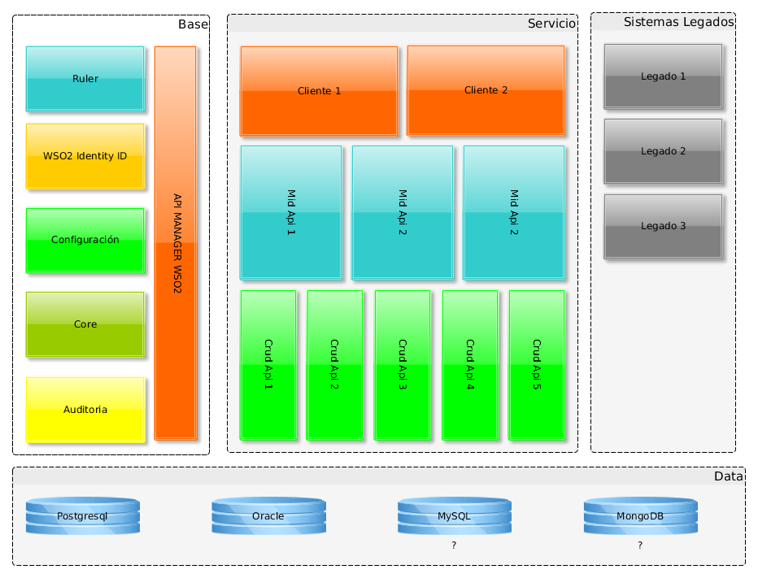
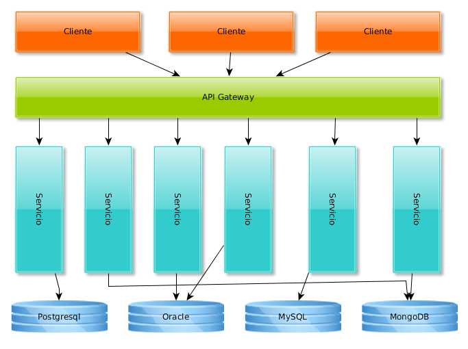

# Arquitectura de aplicaciones

## Entorno general de aplicaciones

El entorno de las aplicaciones actualmente es una mixtura de arquitecturas, entre las cuales se mantienen aplicaciones con arquitecturas monolíticas, cliente servidor y orientadas a servicios; el mantenimiento y gestión de dicho entorno se convierte en fuente frecuente de problemas en los que por desconocimiento, por falta de documentación o por falta de planeación se realizan retrabajos, desarrollos duplicados, incongruencia en la información y otros problemas que se presentan frecuentemente.

Aunque ya existe una definición de elementos comunes que compartirán las aplicaciones o componentes del entorno de trabajo, como un servidos de identidades,  

## Microservicios

### Micro-servicios, que son?
Las arquitecturas orientadas a micro-servicios buscan descomponer aplicaciones monolíticas para mejorar las capacidades de despliegue y escalabilidad  en ambientes de frecuentes cambios y evolución de los sistemas. Esta descomposición propone retos no presentes en aplicaciones monolíticas.

Según Martín Fowler la arquitectura de microservicios es una particular manera de diseñar aplicaciones de software como un conjunto de servicios independientemente desplegables.  

En la arquitectura de microservicios, los servicios deben ser pequeños, granulares, aislados, independientes y distribuibles. Estas características permiten:

* Priorizar recursos escasos.
* Desarrollo en paralelo, por diferentes grupos de desarrollo.
* Independencia tecnológica de cada servicio.
* Escalamiento individualizado.

### Compartiendo código entre microservicios
Una de las inquietudes en el proceso de adopción de microservicios es ¿Cómo compartir código entre microservicios? una respuesta a este punto puede ser la generación de librerías de utilitarias técnicas y funcionalidades comunes, se debe tener cuidado en evitar el acoplamiento entre servicios. También se puede pensar en configurar estas funcionalidades como servicios independientes que puedan se usados por los otros servicios. Con estas dos opciones se debe buscar y definir un punto de equilibrio para este tema.

### Comunicación entre microservicios
La comunicación entre microservicios también genera dudas, esta debe definirse desde la contextualización del negocio, ya que tenemos dos opciones para manejar este punto, la primera es comunicación con respuesta directa mediante el protocolo HTTP. La segunda opción será un mecanismo de suscripción y publicación a una cola de mensajes, lo que nos brinda un mecanismo asíncrono de comunicación evitando el acoplamiento.

### Gestión de las dependencias de los clientes
Una tercera preocupación es que dada la alta granularidad de los servicios como manejo el alto grado de dependencia que genera la comunicación e las peticiones de los clientes hacia los microservicios y que un cambio en los microservicios no afecte a los clientes de estos.

Para gestionar estas dependencias se sugiere el uso de un API Gateway, esta es una capa abstracta que oculta los microservicios a los clientes y ofrece un end-point único para la comunicación. Esto nos permite adicionalmente la monitorización de los microservicios.

