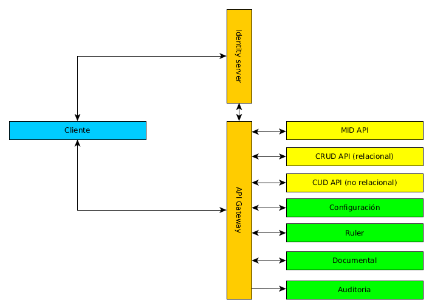

# Arquitectura de aplicaciones

## Alcance

La arquitectura de aplicaciones define el contexto de la estructura y características de las aplicaciones de los proyectos de desarrollo sobre las nuevas tecnologías seleccionadas para los nuevos proyectos, la arquitectura aquí presentada pretende definir un entorno que permita aplicar metodologías ágiles al proceso de desarrollo con un alto grado de automatización de las diferentes etapas del ciclo de vida de desarrollo.

La presente propuesta arquitectural surge de la difcultad actual en el desarrollo del ciclo de vida de los proyectos de software por la característica monolítica de las aplicaciones y su puesta en producción. La arquitectura actual es inapropiada para promover la implantación total de agilismo en los procesos de desarrollo y en las diferentes fases o etapas que estos conllevan.

## Entorno general de aplicaciones

El entorno de las aplicaciones actualmente es una mixtura de arquitecturas, entre las cuales se mantienen aplicaciones con arquitecturas monolíticas, cliente servidor y orientadas a servicios; el mantenimiento y gestión de dicho entorno se convierte en fuente frecuente de problemas en los que por desconocimiento, por falta de documentación o por falta de planeación se realizan retrabajos, desarrollos duplicados, incongruencia en la información y otros problemas que se presentan frecuentemente.

Aunque ya existe una definición de elementos comunes que compartirán las aplicaciones o componentes del entorno de trabajo, como un servicio de identidades o un api manager que se comporta como gateway de peticiones a las apis, se debe hacer una transición hacia una separación de incumbencias con la finalidad de lograr una mejor gestión de los componentes de aplicación desarrollados.

## Orientación a servicios

La presente propuesta arquitectural esta enmarcada por las arquitecturas orientadas a servicios por lo tanto se defeine respetando los principios y priorizaciones que esta define, la orientación a servicios permite la entrega continua de valor al negocio de la organización, con mayor agilidad y alineada con necesidades cambiantes.

Los principios rectores de la arquitectura orientada a servicios son:

-- El valor del negocio por encima de la estratégia técnica.
-- Las metas estrategicas por encima de los beneficios de los proyectos.
-- La interoperatibidad intrínseca por encima de la integración personalizada.
-- Los servicios compartidos por encima de las implementaciones de propósito específico.
-- La flexibilidad por encima de la optimización.
-- El refinamiento evolutivo por encima de la búsqueda de la perfección inicial.

## Microservicios

### Micro-servicios, que son?
Las arquitecturas orientadas a micro-servicios buscan descomponer aplicaciones monolíticas para mejorar las capacidades de despliegue y escalabilidad  en ambientes de frecuentes cambios y evolución de los sistemas. Esta descomposición propone retos no presentes en aplicaciones monolíticas.

Según Martín Fowler la arquitectura de microservicios es una particular manera de diseñar aplicaciones de software como un conjunto de servicios independientemente desplegables.

En la arquitectura de microservicios, los servicios deben ser pequeños, granulares, aislados, independientes y distribuibles. Estas características permiten:

* Priorizar recursos escasos.
* Desarrollo en paralelo, por diferentes grupos de desarrollo.
* Independencia tecnológica de cada servicio.
* Escalamiento individualizado.

### Compartiendo código entre microservicios
Una de las inquietudes en el proceso de adopción de microservicios es ¿Cómo compartir código entre microservicios? una respuesta a este punto puede ser la generación de librerías de utilitarias técnicas y funcionalidades comunes, se debe tener cuidado en evitar el acoplamiento entre servicios. También se puede pensar en configurar estas funcionalidades como servicios independientes que puedan se usados por los otros servicios. Con estas dos opciones se debe buscar y definir un punto de equilibrio para este tema.

### Comunicación entre microservicios
La comunicación entre microservicios también genera dudas, esta debe definirse desde la contextualización del negocio, ya que tenemos dos opciones para manejar este punto, la primera es comunicación con respuesta directa mediante el protocolo HTTP. La segunda opción será un mecanismo de suscripción y publicación a una cola de mensajes, lo que nos brinda un mecanismo asíncrono de comunicación evitando el acoplamiento.

### Gestión de las dependencias de los clientes
Una tercera preocupación es que dada la alta granularidad de los servicios como manejo el alto grado de dependencia que genera la comunicación e las peticiones de los clientes hacia los microservicios y que un cambio en los microservicios no afecte a los clientes de estos.

Para gestionar estas dependencias se sugiere el uso de un API Gateway, esta es una capa abstracta que oculta los microservicios a los clientes y ofrece un end-point único para la comunicación. Esto nos permite adicionalmente la monitorización de los microservicios.

## Arquitectura general de microservicios
La generación de microservicios permite desacoplar los módulos de las aplicaciones para facilitar su despliegue, pero esto supone el reto de establecer el mecanismo para que estos servicios trabajen en conjunto, la siguiente gráfica presenta la estructura propuesta para organizar dicho mecanismo, permitiendo a característica de servicios agnósticos.

### Clente:
El cliente en la estructura de aplicaciones consistenen un estático que obedece al aradigma de "serverless" que únicamente maneja la capa de presentación hacia el usuario final, este componente de la estructura de aplicaciones genera peticiones al api-manager las cuales estánnorientadas a servicios de tipo MID.

### Identity Server:
El Indentity server es el componente de autenticación, este componente es único para todos los servicios, su responsabilidad es autenticar a los usuarios, generar el token de autenticación y validar este cunado las APIs lo solicitan.

### API Gateway:
El API Gateway se comporta como un Gateway de solicitudes entre aplicaciones, toda la comunicación de solicitudes entre servicios debe ser atentida por el API Gateway y este direccionará la petición deacuerdo al catalogo de servicios configurados.

### Auditoría:
El servicio de auditoría es el responsable de registrar todos los eventos que ocurren entre los diferentes servicios, ya que el responsable de gestionar estos eventos es el API Manager, sera este quien se conecte con el servicio de auditoría para el registro del evento.

### RULER:
El ruler es el gestor de reglas de negocio para los servicios de tipo MID, a este le consultan la declaración de todos los predicaos que forman la base de conocimiento para cada contexto.

### CRUD API:
Los servicios de tipo CRUD son la capa de abstracción para la persistencia, en esta capa se manejan dos tipos de servicios: los relacionales y los no relacionales. Estos servicios no manejan la lógica de negocio de ningún contexto, solo representan las diferentes entidades que existen en las bases de datos y controlan el acceso a las operaciones que en estas se permiten.

### MID API:
En estos servicios, se maneja la lógica de negocio en colaboración con el RULER, dada la orientación a microservicios, los servicios de esta capa serán servicios integradores que manejan además de la lógica las transacciones requeridas por el contexto.

### Configuración
Con la proliferación de microservicios, permitir que cada uno maneje su configuración puede ser un problema de gestión inmanejable, por esto debe existir un nodo centralizado de configuración que actúe como repositorio de la configuración para todo el entorno de microservicios.

## Modelo de implementación

## Modelo de despliegue

## Lineamientos generales de arquitectura

### sobre la estructura

* Los servicios de CRUD solo deben obedecer a acciones de creación, edición, consulta o deshabilitación de registros, en ningún caso deben manejar transacciones de negocio que implican lógica  de negocio.
* Las transacciones deben ser maejadas en los servicios integradores (servicios MID).
* La logica de negocio debe ser externa a la codificación del componente y se consume como servicio del RULER.
* Ningun microservicio debe consumir directamente otro microservicio y el llamado ocurre mediante el Gateway (API Manager).
* Los microservicios integradores (servicios MID) no deben realizar operaciones sobre la persistencia ni manejar conexiones a bases de datos, ya que delegan estas operaciones a los servicios CRUD.
* los servicios independientemente de la orientación de estos deben gestionar la validación del token de autenticación del uauario y la validación de permisos sobre las operaciones que estos ofrecen.
